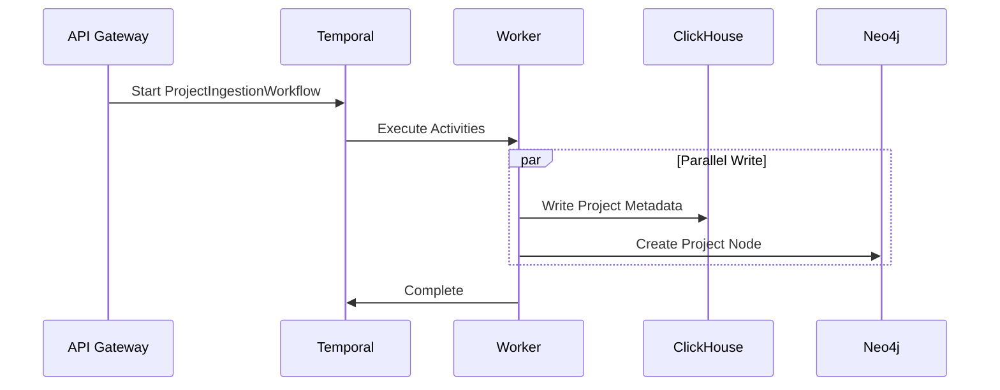
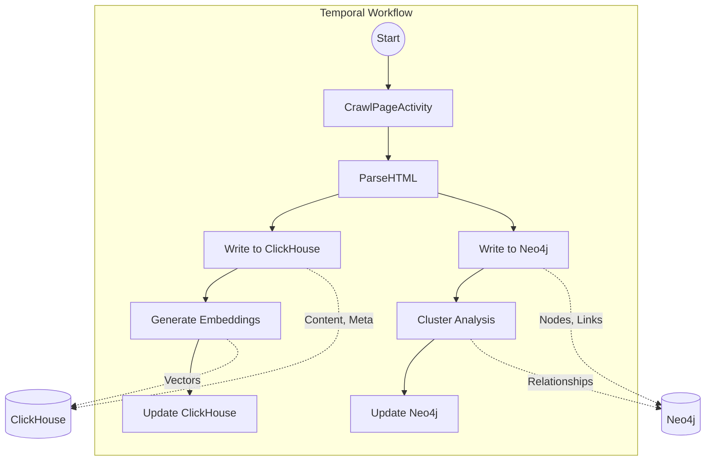

# Integration Architecture

## 1. Overview

ApexSEO employs a **Microservices-based Architecture** with a **Dual-Store Data Strategy**. The system is designed for high-scale SEO analysis, leveraging specialized databases for different data types and a robust orchestration engine for complex workflows.

## 2. Core Components

### 2.1. Databases (The Dual-Store Pattern)

We use a "Right Tool for the Job" approach, splitting data between a Graph Database and a Columnar Store.

| Component | Technology | Role | Key Data |
| :--- | :--- | :--- | :--- |
| **The Map** | **Neo4j** | Stores the structural web of the internet. Optimized for traversal, relationship analysis, and graph algorithms. | Sites, Pages, Links, Clusters, Keywords. |
| **The Library** | **ClickHouse** | Stores high-volume content, metadata, and analytics. Optimized for aggregation, filtering, and vector search. | HTML Content, Embeddings, Rankings, Audit Logs. |

### 2.2. Orchestration

| Component | Technology | Role |
| :--- | :--- | :--- |
| **The Conductor** | **Temporal** | Manages long-running, reliable workflows. Ensures fault tolerance, retries, and state management for distributed processes. | Crawling, Scoring, Reporting. |

### 2.3. Services

| Component | Technology | Role |
| :--- | :--- | :--- |
| **API Gateway** | **Fastify** | Entry point for the frontend. Handles auth, rate limiting, and routing. |
| **Worker Cluster** | **Node.js** | Executes Temporal Activities. Scalable pool of workers processing tasks. |

## 3. Integration Patterns

### 3.1. Ingestion Flow (Saga Pattern)

When a new project is added, a Temporal Workflow orchestrates the ingestion across both stores.

### 3.2. Crawl & Analysis Flow

Data flows from the crawler to both databases, with Temporal ensuring consistency.

### 3.3. Data Synchronization (The Truth Table)

To maintain consistency without distributed transactions, we define a "Source of Truth" for each data entity.

| Entity | Source of Truth | Secondary Store | Sync Mechanism |
| :--- | :--- | :--- | :--- |
| **URL Structure** | Neo4j | ClickHouse | Workflow (Crawl) |
| **Links** | Neo4j | ClickHouse (Aggregates) | Workflow (Crawl) |
| **Content** | ClickHouse | Neo4j (Title/H1) | Workflow (Crawl) |
| **Embeddings** | ClickHouse | None | Workflow (Analysis) |
| **Clusters** | Neo4j | ClickHouse (ClusterID) | Workflow (Clustering) |

## 4. Service Boundaries

### 4.1. API Gateway (`packages/api`)
- **Responsibility**: Request handling, Authentication, Validation, Querying Databases for UI.
- **Constraint**: **READ-ONLY** access to Databases (mostly). **WRITE** operations should trigger Temporal Workflows.
- **Direct Writes**: Allowed only for simple entities (e.g., User Settings) that don't require orchestration.

### 4.2. Workers (`packages/workers`)
- **Responsibility**: Heavy lifting, External API calls, Database Writes, Complex Logic.
- **Constraint**: Stateless. All state must be passed via Temporal Context or persisted in DB.

### 4.3. Shared Library (`packages/shared`)
- **Responsibility**: Common Types, Database Clients, Utility Functions.
- **Constraint**: Must be stateless and side-effect free (except for DB clients).
